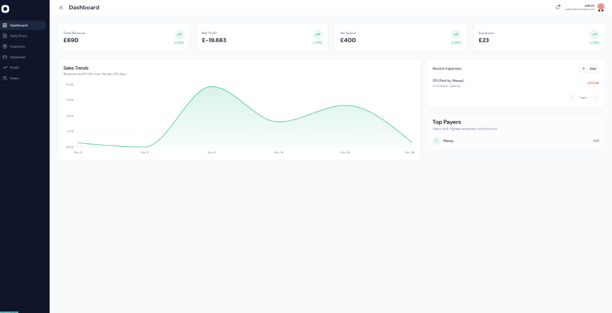
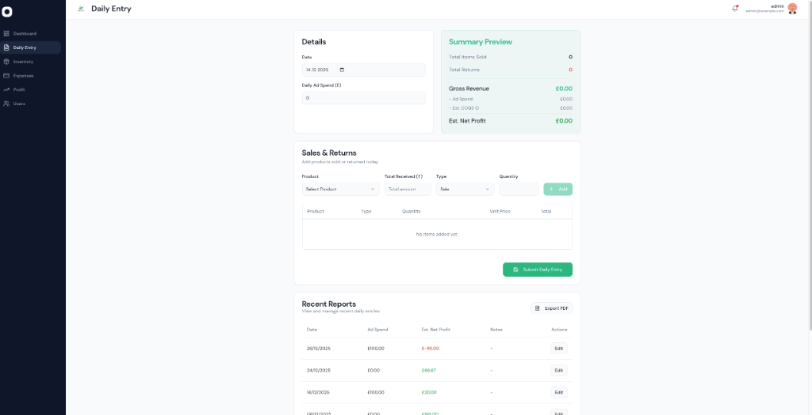
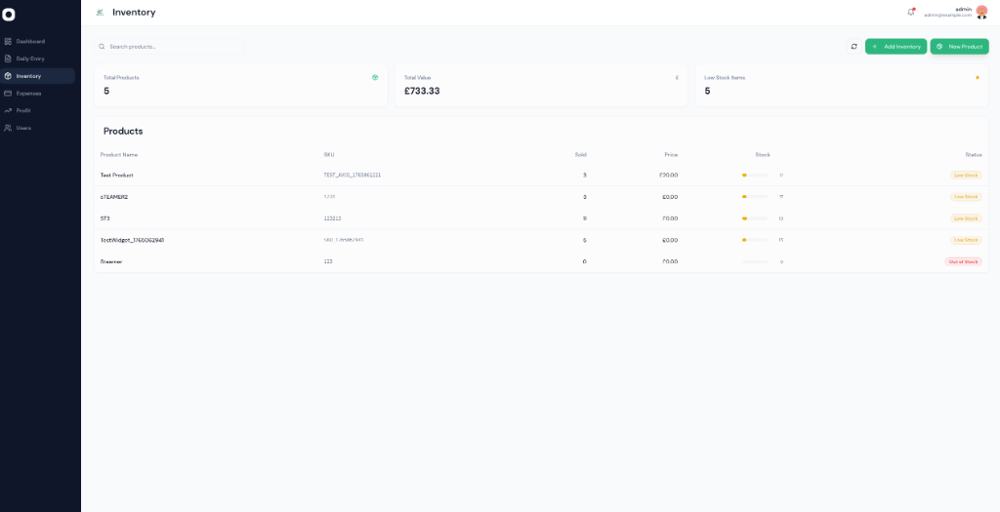
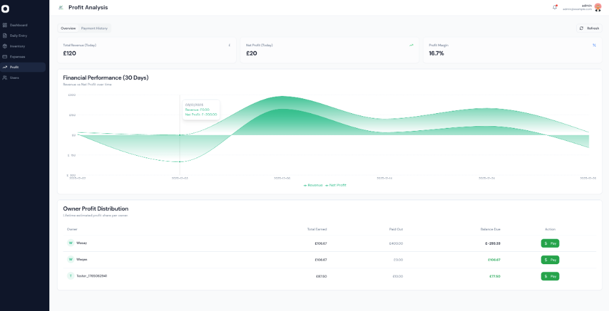

# Profit-and-Expense-Tracker

A comprehensive financial dashboard to track revenue, expenses, profit, and sales trends for your business.

**Live Demo:** [https://tiktrack-frontend-latest.onrender.com/login](https://tiktrack-frontend-latest.onrender.com/login)

## Available Data (Seeded)

The application comes seeded with the following default users:

| Email | Password |
|-------|----------|
| `admin@example.com` | `admin123` |

You can use these credentials to log in to the application locally or in production if the database is reset.

## Tech Stack
- **Frontend**: React, Vite, TailwindCSS
- **Backend**: FastAPI, Python
- **Database**: PostgreSQL (via Docker)
- **Containerization**: Docker & Docker Compose

## Screenshots

### Dashboard Overview

### Daily Entry & Reporting

### Inventory Management

### Profit Analysis

### AI Business Assistant
The application includes a powerful **AI-powered Chat Assistant** (tiktrack-assistant) that can:
- Answer questions about your sales, expenses, and profit.
- Check inventory levels and identify low-stock items.
- Provide insights into your business performance.

